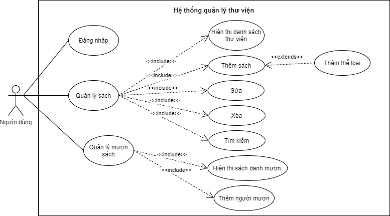
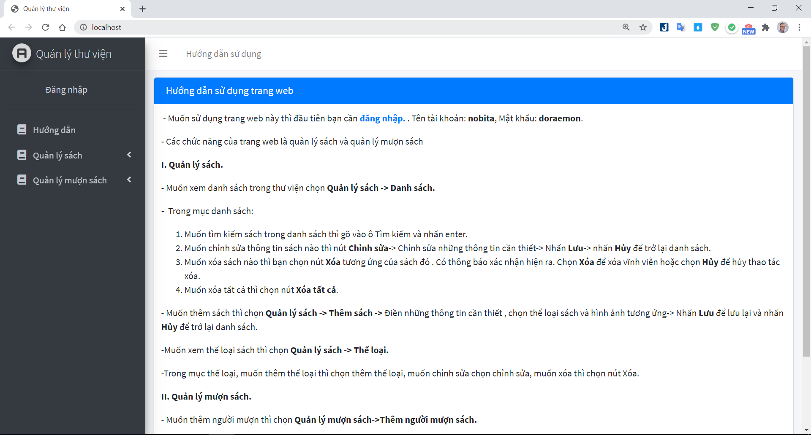
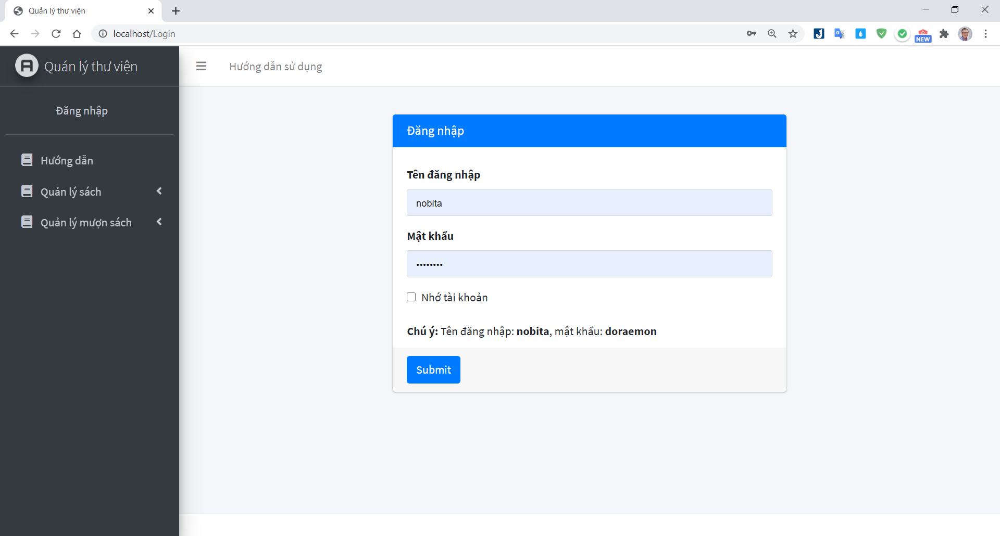
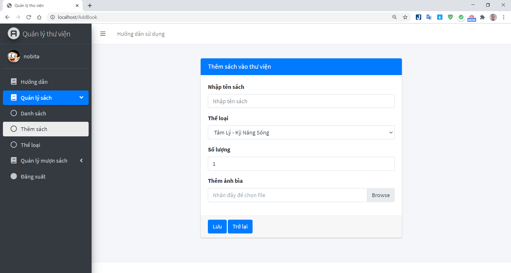
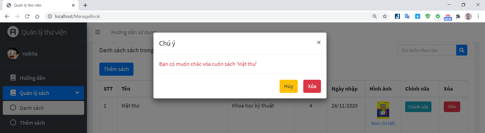
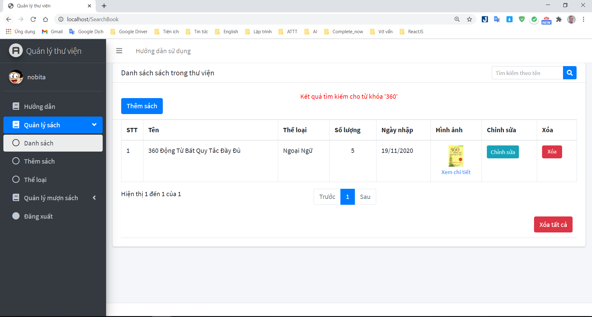

# Lập trình mạng Quản Lý Thư Viện sử dụng JSP/Servlet theo mô hình MVC!
Trên đây là source của báo cáo cuối kỳ môn Lập Trình Mạng.
- Truy cập trang web để xem demo: [http://lemanhltm.j.layershift.co.uk/](http://lemanhltm.j.layershift.co.uk/)
- Tên đề tài : **Quản Lý Thư Viện.**
- Ngôn ngữ backend: [Java JSP/Servlet](https://o7planning.org/vi/10979/java-servlet-jsp)
- Cơ sở dữ liệu: MySQL.
- Sever : Apache Tomcat® - Apache Tomcat 8.5.59
- Ngày bắt dầu code: 11/11/2020
- Công bố version 1.0. : 19/11/2020 (Hoàn thành tương đối các chức năng theo sơ đồ use_case)
- Thông tin báo cáo : [tại đây](Document/BaoCaoCKLTM.pdf)
## Mục lục:
1.[Hướng dẫn cài đặt](#p1)

2.[Các chức năng chính của chương trình](#p2)

3.[Cấu trúc thư mục chương trình](#p3)

4.[Tài liệu tham khảo](#p4)

<a id="p1"></a> 
# Hướng dẫn cài đặt:
1. Clone code từ github:

```shell
git clone https://github.com/lemanh99/QuanLyThuVienJSPServletMVC.git
```

2. Cài đặt Java : [Java JDK 13](https://www.oracle.com/java/technologies/javase-jdk13-downloads.html)

3. Download database: [here](Database/manage_library.sql) hoặc truy cập [thư mục](Database)

4. Cài đặt môi trường lập trình
 - [Eclipse](https://www.eclipse.org/downloads/)
 - [Apache Tomcat® - Apache Tomcat 8.5.59](https://tomcat.apache.org/download-80.cgi)

5. Khởi chạy chương trình:
	- Run với server tomcat phiên bản 8.5.59
7. Truy cập trang chủ: Làm theo hướng dẫn sử dụng
6. Tài khoản đăng nhập trang admin:  Tai khoan đăng nhập: [nobita](https://vi.wikipedia.org/wiki/Nobi_Nobita) ,password: [doraemon](https://vi.wikipedia.org/wiki/Doraemon_(nh%C3%A2n_v%E1%BA%ADt))

<a id="p2"></a> 
# Các chức năng chính của chương trình.
Được đặc tả qua tài liệu Usecase tổng quát:
<div align='center'>
  
</div>

- Giao diện chính:
+ Hướng dẫn sử dụng

+ Đăng nhập

+ Thêm

+ Sửa

+ Xóa

+ Tìm kiếm


<a id="p3"></a> 
# Cấu trúc thư mục
```
$ Cấu trúc thư mục
.
├── Database
│   ├── manage_library.sql
├── Document
│   ├── BaoCaoCKLTM.doc
│   └── BaoCaoCKLTM.pdf
├── images
│   ├── .........
├── Source Code
│   ├── QuanLyThuVien
│   	└── src (Chứa các file servlet)
│   	└── WebContent (Chứa các file JSP/Css/Javascrip/Bootstrap)
└── README.md

```

<a id="p4"></a> 
# Tài liệu tham khảo
 1. Template : [https://adminlte.io//](https://adminlte.io/)
 2. Báo cáo : [Download](Document/BaoCaoCKLTM.pdf)
